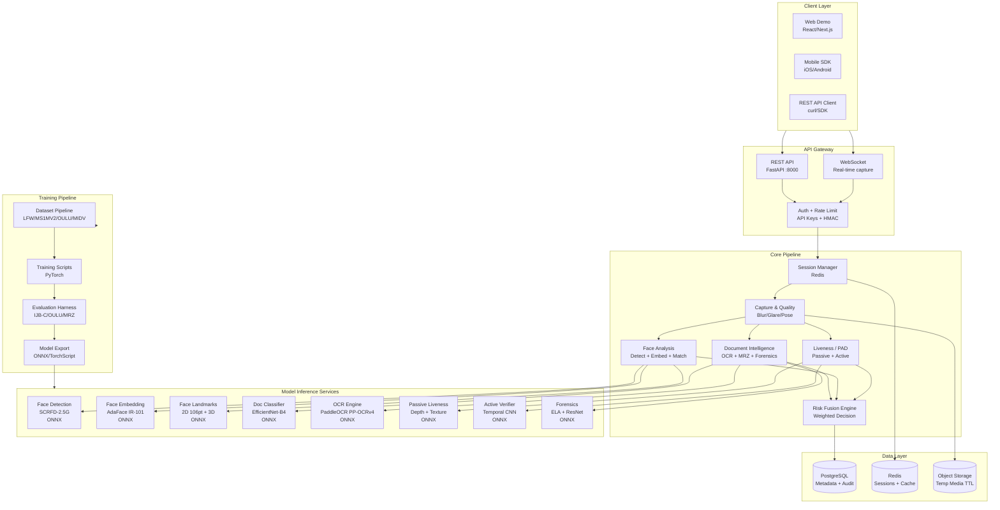

# Cirkle Identity Platform — Self-Hosted KYC Architecture

## 1. HIGH-LEVEL ARCHITECTURE



## 2. MODULE BREAKDOWN WITH CHOSEN BACKBONES

### Module 1: Capture & Quality Layer
- **Camera Guidance**: WebRTC getUserMedia + canvas capture
- **Quality Gates**: OpenCV blur detection (Laplacian variance), glare (specular highlight), resolution check, pose estimation (head Euler angles via landmarks)
- **Document Edge Detection**: Canny + Hough lines → perspective correction (cv2.warpPerspective)
- **Face Stream**: 5fps continuous capture → quality scoring → best frame selection

### Module 2: Document Intelligence
- **Classification**: EfficientNet-B4 (ONNX) — 50+ doc types (passport TD3, national ID, driver license, residence)
- **OCR**: PaddleOCR PP-OCRv4 (multilingual: Arabic + English + Latin)
- **MRZ Parser**: Custom ICAO 9303 parser (TD1/TD2/TD3) with check-digit validation (mod-10, weights 7,3,1)
- **VIZ ↔ MRZ Consistency**: Cross-check extracted fields vs MRZ decoded fields
- **Forensics**: 
  - Error Level Analysis (ELA) — re-compress at known quality, compare
  - Noise residual analysis — local variance per quadrant
  - Clone detection — block-hash matching
  - Font consistency — character spacing analysis
  - Layout template matching — compare to known document templates

### Module 3: Face Analysis
- **Detection**: SCRFD-2.5G (InsightFace) — 5-point + 106-point landmarks
- **Alignment**: ArcFace standard alignment (112×112, 5-point affine)
- **Embedding**: AdaFace IR-101 (quality-adaptive margin) — 512-d embedding
- **1:1 Matching**: Cosine similarity with quality-aware threshold (0.36-0.42 depending on image quality)
- **Gallery Search** (optional): Faiss IVF index for 1:N search

### Module 4: Liveness / PAD (ISO/IEC 30107-3)
**A. Passive (zero friction)**:
- Texture analysis: LBP + CLBP (Local Binary Patterns)
- Frequency domain: FFT for moiré/screen-grid detection
- Monocular depth: MiDaS-style depth estimation (small DPT)
- Subtle motion: optical flow variance + rPPG (remote photoplethysmography)
- Deepfake detection: EfficientNet-B0 on face regions (frequency artifacts)

**B. Active (challenge-response)**:
- Challenges: head turn L/R/U/D, blink, smile, mouth open, follow target
- Verification: Temporal CNN (3D-ResNet) on challenge video sequences
- Geometric verification: head pose estimation (Euler angles) per frame

### Module 5: Decision & Risk Engine
- Weighted fusion: `score = w1*doc_authenticity + w2*face_match + w3*liveness + w4*device_signals`
- Configurable thresholds per use-case (banking: strict, age check: lenient)
- Reason codes: 50+ specific codes (DOC_FORGERY_DETECTED, FACE_MISMATCH, LIVENESS_FAILED, etc.)
- Immutable audit trail: append-only log with HMAC chain

### Module 6: API & SDK Layer
- **REST**: FastAPI with OpenAPI docs, session-based flow
- **WebSocket**: Real-time capture guidance + quality feedback
- **Webhooks**: HMAC-signed callbacks (verification.completed/rejected/fraud.detected)
- **SDKs**: TypeScript (npm), Python (pip), mobile (iOS/Android)
- **Security**: TLS 1.3, AES-256 at rest, PII auto-deletion (30-day TTL), GDPR endpoints

## 3. PUBLIC DATASETS + PREPROCESSING

### Face Recognition
| Dataset | Size | Purpose | Preprocessing |
|---------|------|---------|---------------|
| MS1MV2 | 5.8M images / 80K IDs | Training (ArcFace/AdaFace) | Align to 112×112, flip augmentation |
| WebFace4M | 4M / 10K IDs | Training (alternative) | Same alignment |
| IJB-B | 21K / 1.8K IDs | Evaluation (1:1 + 1:N) | Standard IJB-B protocol |
| IJB-C | 26K / 3.5K IDs | Evaluation (1:1 + 1:N) | Standard IJB-C protocol |
| LFW | 13K / 1.7K IDs | Quick evaluation | Pair-wise matching, 10-fold CV |
| CFP-FP | 7K / 500 IDs | Frontal-Profile eval | 10-fold CV, frontal→profile |
| AgeDB | 16K / 1.6K IDs | Cross-age eval | Pair-wise, 10-fold CV |

### Face Detection / Landmarks
| Dataset | Size | Purpose | Preprocessing |
|---------|------|---------|---------------|
| WIDER FACE | 32K images | Detection training | COCO format, scale augmentation |
| AFLW | 25K / 22K faces | 21-point landmarks | Crop + augment |
| 300W | 4K / 14K faces | 68-point landmarks | 40% increase + flip |

### Liveness / PAD
| Dataset | Size | Purpose | Preprocessing |
|---------|------|---------|---------------|
| OULU-NPU | 4,950 videos | Protocol 1-4 (main eval) | Video→frames, 30fps normalize |
| CASIA-FASD | 600 videos | Cross-dataset eval | Same |
| Replay-Attack | 1,300 videos | Cross-dataset eval | Same |
| MSU-MFSD | 440 videos | Cross-dataset eval | Same |
| CelebA-Spoof | 625K images | Large-scale training | Resize 256×256, augment |
| SiW | 1,800 videos | Dynamic + adaptive | Video→frames |
| SiW-Mv2 | 27K videos | Advanced attacks | Video→frames |

### Document / OCR / MRZ
| Dataset | Size | Purpose | Preprocessing |
|---------|------|---------|---------------|
| MIDV-500 | 15K images / 50 types | Doc classification + OCR | Crop + perspective correct |
| MIDV-2020 | 28K / 200 types | Extended doc types | Same |
| Custom MRZ | Synthetic | MRZ parser training | ICAO 9303 generator |

## 4. FOUR-WEEK IMPLEMENTATION PLAN

### Week 1: Face Analysis Pipeline (HIGHEST RISK)
- Day 1-2: Install InsightFace + download buffalo_l models
- Day 3-4: Face detection service (SCRFD) → alignment → embedding (AdaFace)
- Day 5: 1:1 matching with quality-aware threshold
- Day 6-7: Evaluation on LFW + IJB-C (TAR@FAR=1e-4)

### Week 2: Passive Liveness (HIGHEST RISK)
- Day 1-2: Dataset pipeline (OULU-NPU + CelebA-Spoof download + preprocessing)
- Day 3-4: Texture (LBP/CLBP) + frequency (FFT moiré) + depth (MiDaS)
- Day 5: Deepfake detection (EfficientNet-B0)
- Day 6-7: Fusion + OULU-NPU Protocol 1-4 evaluation (APCER/BPCER)

### Week 3: Document Intelligence + Active Liveness
- Day 1-2: PaddleOCR + MRZ parser + ICAO 9303
- Day 3: Document classifier (EfficientNet-B4) + forensic analysis (ELA + clone)
- Day 4-5: Active liveness — challenge generation + temporal CNN
- Day 6-7: Integration + cross-module consistency checks

### Week 4: API + Risk Engine + Production
- Day 1-2: FastAPI REST + WebSocket + session management
- Day 3: Risk fusion engine + reason codes + audit trail
- Day 4-5: Web demo integration + SDK
- Day 6-7: Security hardening + deployment guide + documentation

## 5. MODULE INTERFACE DEFINITIONS

### Face Analysis Service
```python
# POST /face/analyze
# Input: { image: base64 }
# Output: {
#   detected: bool,
#   landmarks: { points: [[x,y]...], count: 106 },
#   quality: { score: 0.0-1.0, blur: bool, glare: bool, pose: {yaw, pitch, roll} },
#   embedding: [float; 512],  # AdaFace IR-101
#   bbox: {x, y, w, h}
# }
```

### Face Match Service
```python
# POST /face/match
# Input: { image1: base64, image2: base64 }
# Output: {
#   is_match: bool,
#   similarity: float (0-1),
#   threshold: float (quality-adaptive),
#   quality1: { score: 0.0-1.0 },
#   quality2: { score: 0.0-1.0 },
#   reason: string  # "match", "no_face", "low_quality", "below_threshold"
# }
```

### Passive Liveness Service
```python
# POST /liveness/passive
# Input: { frames: [base64], count: int }
# Output: {
#   is_live: bool,
#   score: float (0-1),
#   pad_score: float,  # presentation attack probability
#   signals: {
#     texture: float,       # LBP/CLBP score
#     frequency: float,     # FFT moiré score
#     depth: float,         # depth consistency
#     motion: float,       # optical flow variance
#     rppg: float,          # remote photoplethysmography
#     deepfake: float,     # deepfake artifact score
#   },
#   reason: string
# }
```

### Document Intelligence Service
```python
# POST /document/analyze
# Input: { image: base64, doc_type: str }
# Output: {
#   classification: { type: str, country: str, confidence: float },
#   ocr: { text: str, fields: {name, dob, doc_num, expiry, nationality, gender} },
#   mrz: { parsed: bool, fields: {...}, check_digits_valid: bool },
#   forensics: { tampering_score: float, ela_anomaly: bool, clone_detected: bool },
#   viz_mrz_consistency: { match: bool, discrepancies: [str] },
#   confidence: float (0-1)
# }
```

### Risk Fusion Engine
```python
# POST /risk/evaluate
# Input: {
#   doc_result: {...},
#   face_result: {...},
#   liveness_result: {...},
#   config: { thresholds: {...}, weights: {...} }
# }
# Output: {
#   decision: "approve" | "review" | "reject",
#   score: float (0-1),
#   reason_codes: [str],
#   audit: { timestamp, session_id, hash_chain },
#   explainability: { factors: [{name, contribution, detail}] }
# }
```
